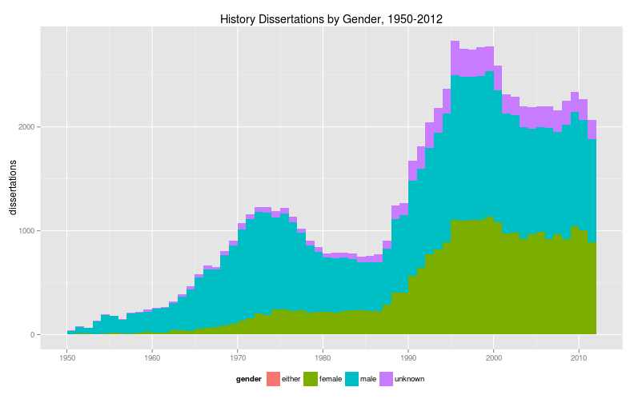
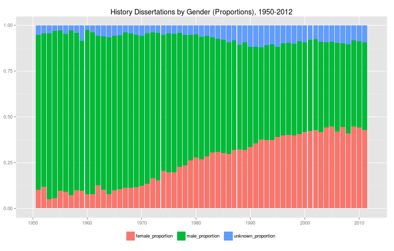
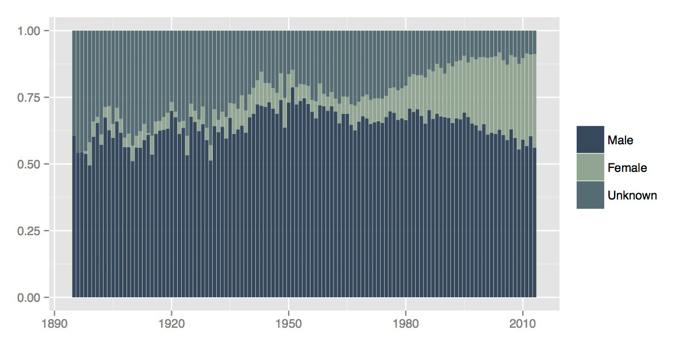
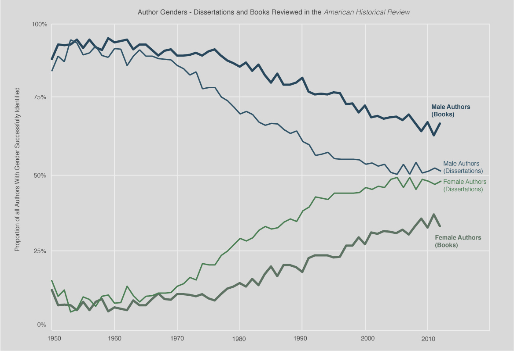
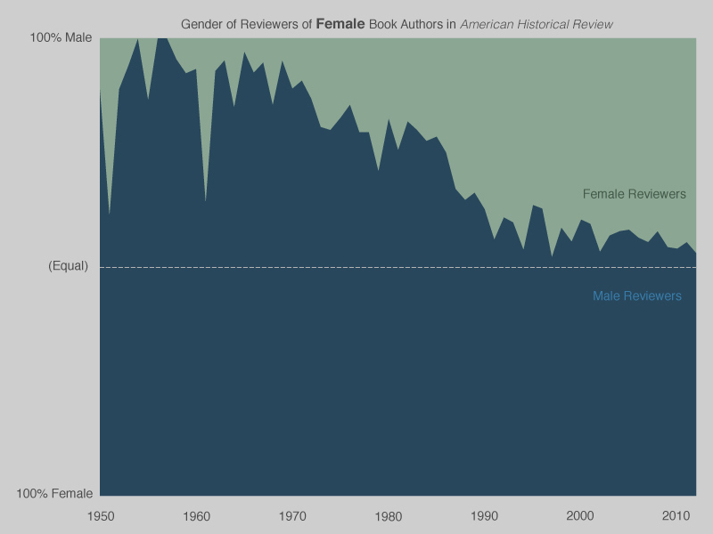
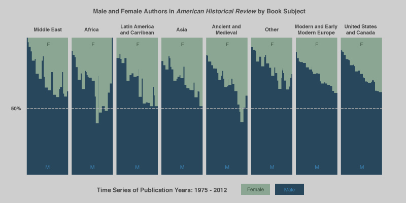

```{r load-libraries, include=FALSE}
library(genderdata)
library(gender)
library(dplyr)
library(ggplot2)
library(mullenMisc)
library(knitr)
library(stringr)
library(scales)

# TRUE to show code and warnings; FALSE to remove them for publication
display_code_blocks(FALSE)

# Add a thousands separator
knit_hooks$set(inline = function(x) {
  prettyNum(x, big.mark=",")
})

```

### Abstract

This paper addresses two trends in the humanities: the rise of gender as an analytical tool and the proliferation of large, machine-readable datasets. It outlines a new method for algorithmically inferring the gender of a name from historical data in order to take into account how naming practices change over time and space. In contrast to existing methods of predicting gender, this method provides a higher level of accuracy and a precise statement of the likelihood that a name is a given gender. The article describes the methodology as implemented in the [Gender](https://github.com/ropensci/gender) package for the [R programming language](http://www.r-project.org/). It goes on to apply the method to a case study in which we study gender and gatekeeping in the history profession by inferring the gender of authors of history dissertations and of authors and reviewers in the *American Historical Review*.

### Introduction: The "Leslie" Problem
 
As humanities researchers grapple with larger and larger datasets they will increasingly be able to not just extract existing information from that data but to also infer additional information from it \[Goldstone and Underwood 2014]\. ^[The availability of large-scale datasets dealing with personal information raises important ethical issues for digital humanists, particularly in light of the revelations about domestic spying at the NSA brought forth by Edward Snowden in 2013. \[Weingart 2014]\ Kieran Healy has used network analysis to demonstrate how researchers can infer information from datasets while also touching on the troubling ethical issue of surveillance \[Kiely 2013]\.] Many of these datasets deal with lists of people: company payrolls, military rosters, passenger bookings, records of correspondence, or lists of published works. Some of these records might contain associated information such a person's address, age, or rank, while others contain little more than a list of personal names. Given large but sparse datasets, researchers have to use their ingenuity to derive additional kinds of information. What can researchers infer from just a name? On a basic level, first names often imply a person's gender. "Jane Fay" is almost certainly a woman, while her brother "John Fay" is almost certainly a man. A straightforward computer program can infer their respective genders with relative ease.
 
The problem with inferring gender from names is that the link between gender and naming practices, like language itself, is not static. What about Jane and John Fay's sibling, Leslie? If Leslie was born in the past sixty years, chances are good that Leslie would be their sister. But if the three siblings were born in the early twentieth century, chances are good that Leslie would be their brother. That is because the gendered naming convention surrounding "Leslie reversed course completely over the course of one hundred years. 92% of the babies born in the United States in 1900 who were named "Leslie" were male, while 96% of those identically named babies born in the year 2000 were female.

```{r leslie}
# We cannot simply use the Social Security figures (even though they probably
# don't present a particular problem for the name Leslie) because later we will
# argue that the gender ratios for the SSA figures before 1930 are skewed. So we
# are going to splice the IPUMS data from before 1930 and the SSA data from
# after 1930.

ipums_leslie <- genderdata::ipums_usa %>%
  filter(name == "leslie", year <= 1930) 

ssa_leslie <- genderdata::ssa_national %>%
  filter(name == "leslie", year > 1930)

leslie_df <- rbind(ipums_leslie, ssa_leslie) %>%
  mutate(prop_female = female / (female + male)) 

leslie_plot <- leslie_df %>%
  ggplot(aes(x = year, y = prop_female)) +
  geom_smooth() + 
  geom_point() +
  ggtitle("Proportion of female uses of the name 'Leslie,' 1820-2012") +
  xlab(NULL) + ylab(NULL) + ylim(0, 1) +
  geom_hline(yintercept = 0.5) + 
  annotate("text", x = 1900, y = 0.45, label = "Male") +
  annotate("text", x = 1900, y = 0.55, label = "Female") 

leslie_plot %>%
  gg_attribution("Data: IPUMS USA; Social Security Administration") %>%
  print()
```

Other names used in the United States such as Madison, Morgan, Sydney, and Kendall, have also "flipped" their gender over the past century. Such changes usually follow set patterns. In general, names tend to shift from being predominantly male to being predominantly female; the shift rarely moves in the other direction. In general, names that transition from male to female also became increasingly popular over time. For example, the name "Madison" changed from male to female quite suddenly after 1985. Whereas before it had been an infrequently used male name, after 1985 it skyrocketed in popularity and by the early 2000s was one of the ten most frequently used names for baby girls. Broadly speaking, in the late twentieth century Americans girls became increasingly more likely than American boys to receive a "trendy" name, and once that name was associated with women it was unlikely to be given to male babies. These names present a moving target for researchers hoping to use them to infer additional information about the people under study. ^[The few exceptions of names which flip from being female to male, such as "Jan", have a different causal mechanism. It seems likely that Jan as an English name is female but that Jan as a Scandinavian name is male. Because the name has remained relatively uncommon, other causes besides changing gender preferences can explain the change.]

```{r plot_names_that_change}
plot_names <-  c("madison",
                 "keanu",
                 "addison",
                 "jan",
                 "sydney",
                 "morgan",
                 "leslie",
                 "kendall")

selected_names_plot <- ssa_national %>%
  filter(name %in% plot_names) %>%
  mutate(prop_female = female / (female + male)) %>%
ggplot(aes(x = year, y = prop_female, color = name)) +
  geom_smooth(se = FALSE) +
  ggtitle("Changes in selected names, 1930-2012") +
  xlim(1930, 2012) + 
  xlab(NULL) + ylab(NULL) + ylim(0, 1) +
  geom_hline(yintercept = 0.5) +
  annotate("text", x = 1965, y = 0.45, label = "Male") +
  annotate("text", x = 1965, y = 0.55, label = "Female") 

selected_names_plot %>%
  gg_attribution("Data: Social Security Administration") %>%
  print()
```

For those working on contemporary subjects the "Leslie" problem is not an especially pressing one. An education policy analyst studying the demographics of different urban school districts, for instance, can turn to a variety of tools that use current databases of names, and these tools will likely identify the gender of Leslie Fay correctly. One online service, [Genderize.io](http://genderize.io/), determines the gender of first names "from user profiles across major social networks." Checking the service for the name Leslie returns a prediction that the name is female, along with an estimate of male/female proportions of the uses among members of unnamed social media sites.^[In this example the Genderize.io service has been accessed through the Gender package described below.]

```{r genderize, echo=TRUE, results='markup'}
gender("Leslie", method = "genderize")
```

But researchers studying a longer timespan need to take into account the changing nature of naming practices. If that same education researcher wanted to compare the demographics of contemporary urban schools with those from the early twentieth century, contemporary tools like Genderize.io would misidentify Leslie Fay's gender in historical datasets. The "Leslie" problem is not just for researchers who think of themselves as historians. Anyone studying a period longer than a few years, or anyone studying a group whose demographics do not match those of a contemporary tool like Genderize.io will also encounter this problem. As of 2012, the average American has a lifespan of nearly seventy-nine years–--more than enough time for naming practices to change quite dramatically between their birth and death \[World Bank 2014]\. Predicting gender from first names therefore requires a fundamentally historical method.
 
Our solution to the "Leslie" problem is to create a software package that combines a predictive algorithm with several historical datasets suitable to various times and regions. The algorithm calculates the proportion of male or female uses of a name in a given birth year or range of years. It thus can provide not only a prediction of the gender of a name, but also a measure of that prediction's likelihood. For example, our program predicts that a person named Leslie born in 1950 is female, but only just barely: 52 percent of the babies named Leslie born in the United States in 1950 were girls and 48 percent were boys. Including these proportion figures allows researchers to conduct more nuanced analysis and to determine for themselves what proportion is acceptable for predicting the gender of names.

We recognize that gender is a fluid concept, both today and in the past, and that this method glosses over the complexities of historical definitions of gender and of the relationship between biological sex and gender \[Butler 1990, Butler 1993]\. In some sense this is unavoidable since the large historical datasets which make this kind of analysis possible were created by state agencies. For the category of gender (as for race) states have offered a limited number of boxes to check, and those boxes extert a tremendous power to define state subjects \[Brubaker and Cooper 2000, 14-17, Pascoe 2009, Canaday 2011, Landrum 2014]\. This method does not presuppose that the gender binary imposed by governments and their wider societies reflect how an individual identifies oneself and is neutral as to what the categories "male" or "female" actually mean in any given historical context. Researchers are free---indeed, obligated---to make that determination for themselves, and this package provides access to the underlying dataset so that researchers can interrogate every assumption that comes with them. This method does not argue against the complexities of historical understandings of gender, but as with any project it does require researchers who use the method to think through how the data was gathered, what it implies, and how it reflects social and cultural practices.
 
The remainder of this article is divided into two sections. First, we describe our method in more detail, compare it to existing methods, and explain how to use it. Second, we apply the method to a case study of gatekeeping in the historical profession in order to demonstrate its utility.
 
### I. The Method

```{r calc_unique_names}
# Numbers of unique names in different data sets, for reference below
unique_names <- function(dataset) {
  dataset$name %>% unique %>% length
  }
  
kantrowitz_unique <- unique_names(genderdata::kantrowitz)
ssa_unique <- unique_names(genderdata::ssa_national)
ipums_unique <- unique_names(genderdata::ipums_usa)
```

Why do scholars need a historical method for inferring gender? Let's start with a comparison. One existing method for predicting gender is available in the [Natural Language Toolkit](http://www.nltk.org/) for Python \[Bird et al. 2009, Chapter 2]\.^[Chapter 6 of \[Bird et al. 2009] also describes a method of predicting gender from the last letter of the name, but this example is given for the sake of explaining supervised classification and not as an end in itself, so we do not have reason to address this a historical method.] The NLTK is an influential software package for scholarship because it provides an extraordinary range of tools for analyzing natural language.^[\[Bird et al. 2009]\ has been cited 812 times according to [Google Scholar](http://scholar.google.com/scholar?cites=3735380965977150091&as_sdt=5,47&sciodt=0,47&hl=en). Because in the humanities (unlike in other fields) the practice of citing software (even software which determines the outcome of an analysis) is regrettably rare, even nonexistent, such metrics are difficult to determine. Yet searching journals such as *Digital Humanities Quarterly* and the *Journal of Digital Humanities* reveals that natural language processing, for which the NLTK is the foremost implementation, is one of the key methodological categories of the digital humanities.] Included in the NLTK are two lists of male and female names created by the computer scientist Mark Kantrowitz with assistance from Bill Ross.^[The [original lists of names](http://www.cs.cmu.edu/afs/cs/project/ai-repository/ai/areas/nlp/corpora/names/0.html) are available at the website of the computer science department at Carnegie Mellon University, and the NLTK implementation is described in its [documentation](http://www.nltk.org/howto/corpus.html).] These lists include `r kantrowitz_unique` unique names. Using the Kantrowitz names corpus in the NLTK, one could look up a name like Jane or John and find out that it is male or female. The Kantrowitz corpus provides the list of names.^[The examples below is drawn from our Gender package which implements the Kantrowitz dataset for comparsion's sake, though its use is not recommended for actual research. The Gender package combines the Kantrowitz corpus's two lists into a single list, identifying names that are ambiguous because they appear on both lists as `"either"`.] 

```{r kantrowitz list, echo=TRUE, results='markup'}
genderdata::kantrowitz
```

One can then easily write a function which looks up the gender of a given name.

```{r abby-kantrowitz, echo=TRUE, results='markup'}
gender("abby", method = "kantrowitz")
```

```{r compare-kantrowitz-ssa, cache=TRUE, eval=FALSE}
# Calculate the error rate of the Kantrowitz data set. This code is very slow, 
# so I have disabled evaluating and hardcoded the value into the text for now.
# We can re-run this for the final version of the article.
cf_kantrowitz_ssa <- data.frame(name = unique(genderdata::kantrowitz$name),
                                stringsAsFactors = "FALSE")

# For just the names in the Kantrowitz corpus, predict the gender with both the Kantrowitz and the SSA method.
cf_kantrowitz_ssa <- cf_kantrowitz_ssa %>%
  group_by(name) %>%
  do(kantrowitz = gender(name = .$name, method = "kantrowitz")$gender,
     ssa = gender(name = .$name, method = "ssa")$gender)

cf_results <- as.character(cf_kantrowitz_ssa$kantrowitz) ==
  as.character(cf_kantrowitz_ssa$ssa)

# Error rate is the number of mismatches to the total number of names
kantrowitz_error_rate <- 1 -(sum(cf_results) / length(cf_results))
```

```{r}
# Hardcode the error rate for now. This value is based on running the code above
# locally.
kantrowitz_error_rate <- 0.2325766
```

The most significant problem with the Kantrowitz names corpus and thus the NLTK implementation is that it assumes that names are timeless. As pointed out above, this makes the corpus problematic for historical purposes. Furthermore the Kantrowitz corpus includes other oddities which make it less suitable. Some names like Abby are overwhelmingly female and some like Bill are overwhelmingly male, but the corpus includes them as both male and female. The Kantrowitz corpus contains only `r kantrowitz_unique` names, a mere `r percent(kantrowitz_unique / ssa_unique)` of the `r ssa_unique` names in the Social Security Administration dataset and `r percent(kantrowitz_unique / ipums_unique)` of the `r ipums_unique` names in the census records provided by Integrated Public Use Microdata (IPUMS) USA. There are therefore many names that it cannot identify. Assuming for the moment that our method provides more accurate results, we estimate that `r percent(kantrowitz_error_rate)` percent of the names in the Kantrowitz corpus are misclassified or classified as ambigious when a valid prediction could be made. **This isn't immediately obvious to me how this error rate was derived. Do we know why or how Kantrowitz is classifying things as ambiguous? Maybe he's just using a much higher, and theoretically more rigorous, cut-off (say 90%) than our 50% cut-off.**

We mention the Kantrowitz name corpus as implemented in NLTK because the Natural Language Toolkit is rightly regarded as influential for scholarship. Its flaws are also typical of the problems with most other implementations of gender prediction algorithms. The Genderize.io API is, for example, a more sophisticated implementation of gender prediction than the NLTK algorithm. Besides predicting male or female for gender, it also reports the proportion of male or female names, along with a count of the number of uses of the name that it is basing its prediction on. Genderize will also permit the user to customize a prediction for different countries, which is an extremely important feature. Genderize.io reports that its "database contains 142848 distinct names across 77 countries and 85 languages." Genderize is unsuitable for historical work, however, because it is based only on contemporary data. According to the documentation for its API, "It utilizes big datasets of information, from user profiles across major social networks." It would be anachronistic to apply these datasets to the past, and Genderize.io provides no functionality to filter results chronologically as it does geographically. In addition, Genderize.io does not make clear exactly what comprises the dataset and how it was gathered, which keeps scholars from interrogating the value of the source \[Genderize.io 2014-]\.^[Quotations are taken from the [Genderize.io website](http://genderize.io), with correspondence from the developer behind the site for confirmation.]

R and Python are two of the most commonly used languages for data analysis \[Piatesky 2014, Muenchen 2014-]\.^[Surveys and analysis of useage point out the growth of R and the continuing popularity of Python among "data science" generally.] Python's existing packages for gender prediction all implement a method similar to the NLTK or Genderize.io.^[**Python library names**] To our knowledge, [CRAN](http://cran.rstudio.com/) (the central repository for R packages) does not include any packages dedicated to gender prediction. In two of the most popular data analysis languages used in the digital humanities there is currently no satisfactory existing method of gender prediction for historical and humanistic research.

To that end we have created the [Gender](https://github.com/ropensci/gender) package for R which includes both the predictive algorithm and an associated [genderdata](https://github.com/lmullen/gender-data-pkg) package containing various historical datasets. This R implementation is based on an [earlier Python implementation](https://github.com/cblevins/Gender-ID-By-Time) by [Cameron Blevins](http://www.cameronblevins.org/) and [Bridget Baird](http://www.conncoll.edu/directories/emeritus-faculty/bridget-baird/). The Gender package is affiliated with [rOpenSci](http://ropensci.org/), an initiative that supports reproducible research and open data for scientists using R. The rOpenSci advisory board has provided code review and publicity for the project.^[The gender package depends especially on \[R Core Team 2014-, Wickham and Francois 2014]\ ]

The possibilities for inferring gender from names depends on two things. First, it needs a suitable (and suitably large) dataset for the time period and region under study. Unsurprisingly such datasets are almost always gathered in the first instance by government entities, though the compilation and digitization may be undertaken by scholarly researchers. Second, it depends on a suitable algorithm for estimating the proportion of male and female names for a given year or range of years, since often a person cannot be associated with an exact date. It is especially important that the algorithm take into account any biases in the data to formulate more accurate predictions. Development of the R package has had two primary aims. The first is to abstract the predictive algorithm to the simplest possible form so that it is usable for a wide range of historical problems rather than depending on the format of any particular data set. The second has been to provide as many datasets as possible in order to localize the predictions to particular times and places. To that end, [Ben Schmidt](http://benschmidt.org/) contributed a dataset of US Census Data and accompanying code, as well as providing a significant correction to predictions based on Social Security Administration data.
 
The Gender package currently includes two datasets which make it suitable for studying the United States from the first federal census in 1790 onwards.^[The authors of the package are both American historians, which explains why the initial release of the package focuses on that country. We have plans, however, to extend the underlying data to six other European and North American countries included in the [North Atlantic Population Project](https://www.nappdata.org/napp/) for the nineteenth century. We also welcome contributions of datasets for other regions and times from other scholars.] The first dataset contains names of applicants for Social Security and available from Data.gov. The second dataset contains names gathered in the decennial censuses and available from the IPUMS-USA (Integrated Public Use Microdata Series) service from the Minnesota Population Center at the University of Minnesota.
 
The Social Security Administration (SSA) "[Baby Names](http://catalog.data.gov/dataset/baby-names-from-social-security-card-applications-national-level-data)" dataset was created as a result of the Social Security Act of 1935 during the New Deal. ^[The Social Security Administration also provides a related dataset which contains the names of applicants broken down by state and year since 1910 \[Social Security Administration 2014-b]\.] This dataset contains a list of first names with the number of male and female uses of the name in every year beginning with 1880 and ending with 2012. The SSA list includes any name which was used more than five times in a given year, thereby capturing all but the most infrequently used names from each year. The description "baby names" provided by the SSA is a serious misnomer. When Social Security first became available during the New Deal, its first beneficiaries were adults past or near retirment age. The dataset goes back to 1880, the birth year for a 55 year-old adult when Social Security was enacted. Even after 1935, registration at birth for Social Security was not mandatory until 1986. As we will demonstrate below, the way in which the data was gathered requires an adjustment to our predictions of gender.^[Shane Landrum has studied the history of birth registration in the United States \[Landrum 2014]\.  It is well-known among American historians that the Social Security Act was written to exclude farmworkers as a means of also excluding African Americans. In examining the dataset we have not found any reason to believe that this policy noticably skewed the prediction of gender from names.]

The IPUMS-USA dataset, contributed by Benjamin Schmidt, contains records from the United States decennial census from 1790 to 1930. This dataset includes the birth year and numbers of males and females under the age of 62 for all the years in that range. This data has been aggregated by IPUMS at the University of Minnesota and is released as a sample of the total census data. Unlike the SSA dataset, which includes 100% of every name reported to the Social Security Administration **not quite - only names that occur more than five times, right?**, the IPUMS data contains 5% or 10% samples. Because the `gender()` function relies on proportions of uses of names, rather than raw counts of people with the names, the sampling does not diminish the reliability of the function's predicitons \[Ruggles et al. 2010]\.

These two datasets (and any future datasets to be added to the package) thus contain a simple table of data. ^[The format of this data departs from the more generally desirable "tidy data" framework proposed by Hadley Wickham for performance reasons. By keeping the data in a "wider" format instead of a tidy format as defined by Wickham, the function is able to make its predictions faster \[Wickham forthcoming]\.] The columns contain the `name`, `year`, and number of `female` and `male` uses of that name in a particular year.

```{r ssa_national, echo=TRUE, results='markup'}
genderdata::ssa_national
```

**unfortunatley the first ten isn't intuitive since it's just "!" rather than names - this is going to confuse readers, I think**
```{r ipums_usa, echo=TRUE, results='markup'}
genderdata::ipums_usa
```

Our method for predicting gender is best understood through a series of examples. First we will use it to predict the gender of a single name in order to demonstrate a simplified version of the inner workings of the function. We will then apply it to a small sample dataset to show how a researcher might use it in practice.

**Example #1: A Sample Name**

The method for predicting gender from a name using the package's datasets is simple. Let's begin by assuming that we want to predict the gender of someone named Sidney who was born in 1935 using the Social Security Administration dataset. Because the dataset contains a list of names for each year, we can simply lookup the row for Sidney in 1935. Using the [dplyr](https://github.com/hadley/dplyr) package for R, this can be expressed in a simple grammar of filtering by name and year.

```{r, echo=TRUE, results='markup'}
genderdata::ssa_national %>%
  filter(name == "sidney", year == 1935)
```

Thus, according to the Social Security Administration, there were 974 boys and 93 girls named Sidney born in 1935. We can add another command to calculate the *proportion* of females and males ("mutate" in dplyr's vocabulary) rather than raw numbers.

```{r, echo=TRUE, results='markup'}
genderdata::ssa_national %>%
  filter(name == "sidney", year == 1935) %>%
  mutate(proportion_female = female / (male + female),
         proportion_male   = 1 - proportion_female)
```

In other words, there is an approximately `r gender("sidney", year = 1935)$proportion_male %>% percent()` percent chance that a person born in 1935 named Sidney was male. In 2012, for comparison, there was an approximately `r gender("sidney", year = 2012)$proportion_female %>% percent()` percent chance that a person born named Sidney was female.

The method is only slightly more complex if we do not know the exact year when someone was born, as is often the case for historical data. Suppose we know that Sidney was born in the 1930s but cannot identify the exact year of his or her birth. Using the same method as above we can look up the name for all of those years.

```{r, echo=TRUE, results='markup'}
genderdata::ssa_national %>%
  filter(name == "sidney", year >= 1930 & year <= 1939) 
```

Next we can sum up the male and female columns ("summarize" in dplyr's vocabulary) and calculate the proportions of female and male uses of "Sideny" during that decade.

```{r, echo=TRUE, results='markup'}
genderdata::ssa_national %>%
  filter(name == "sidney", year >= 1930 & year <= 1939) %>%
  group_by(name) %>%
  summarize(female = sum(female),
            male = sum(male)) %>%
  mutate(proportion_female = female / (male + female),
         proportion_male   = 1 - proportion_female)
```

In other words, for the decade of the 1930s, we can calculate that there is a `r gender("sidney", year = c(1930, 1939))$proportion_male %>% percent()` percent chance that person named Sidney was male. This is roughly the same as the probability we calculated above for just 1935, but our method also returns the figures it used to calculate those probabilities: 1,067 total instances of "Sidney" in 1935 versus 10,110 instances for the decade as a whole.

**Example #2: A Sample Dataset**

The method's real utility stems from being able to process larger datasets than a single name. Let's use, say, a list of editors from a college newspaper to illustrate how a researcher might apply it to their own data. The package's prediction function allows researchers to choose which reference datasets they would like to use and the range of years for making their predictions.^[See the package vignette for more details: `vignette("predicting-gender", package = "gender")`.]

```{r}
editors <- data.frame(name = c("Madison", "Madison", "Morgan",
                                  "Morgan", "Jan", "Jan"),
                         birth_year = c(1934, 1990, 1948, 1970, 1965, 1998),
                         stringsAsFactors = FALSE) %>% tbl_df()
```

```{r, echo=TRUE, results='markup'}
editors
```

The simplest way to use the package would be to call the `gender()` function, specifying the method, in this case the Social Security Administration dataset since all the names are after 1930, and convert the results to a data frame (one of R's native data structures).

```{r, echo=TRUE, results='markup'}
gender(editors$name, method = "ssa") %>% do.call(rbind.data.frame, .)
```

This basic call of the `gender()` function would be suitable if we did not know the birth year for each editor. But we can also specify that in the `gender()` function by using this call:

```{r, echo=TRUE, results='markup'}
Map(gender, editors$name, years = editors$birth_year) %>% 
  do.call(rbind.data.frame, .)
```

By taking into account the year of birth, we find that four of our six names were likely male, whereas we might otherwise have predicted that all six were female. We also now know the approximate likelihood that our predictions are correct: at least 80% for all of thse predictions.

**I think it might be worth expanding this Example #2 section by a paragraph to show how you can dynamically incorporate periods of time rather than single birth years. A single birth year might make humanists uncomfortable since it implies a precision that a lot of people aren't going to have (like in the case of our dissertations and AHR authors). I changed the example to be a list of editors of a college paper. That way we can easily use an age range of 18-22 to demonstrate how a researcher might implement this.** 


**I moved this next caveat section about the SSA data because it felt kind of out of place sandwiched between the two examples. I'm still not sure it fits here, though. I'm trying to figrue out if there's a way to integrate it into the paper that isn't going to be quite so diversionary for the reader.**

As previously mentioned, the history of how the Social Security Administration collected the data effects its validity. Specifically, because the data extends back to 1880 but the first applications were gathered after 1935, the sex ratios in the dataset are skewed, as demonstrated in this plot.

```{r}
genderdata::ssa_national %>%
  group_by(year) %>%
  summarize(ratio = sum(female) /sum(female + male)) %>%
  ggplot(aes(x = year, y = ratio)) +
  geom_line() +
  ggtitle("Percentage of SSA dataset that is female") +
  xlab(NULL) + ylab(NULL)
```

It is extremely improbable that nearly 70 percent of the people born in 1900 were female. Exactly why the dataset has this bias is unclear, though we speculate that it is because the applicants for Social Security in the early years of the program were approaching retirement age, which was set much closer to the average life expectancy in 1935 than it is today. Since women tend to live longer than men, they were overrepresented in Social Security applications.

The solution to this problem is two-fold. First, we recommend that researchers use the IPUMS-USA dataset to make predictions for years from 1790 to 1930 (which avoids the "bubble" in the SSA data) and that they use the SSA dataset for years since 1930.^[The IPUMS-USA dataset includes only apparently random fluctuations in the gender ratio in any given year.] Second, we have built in a correction to the SSA dataset when using the `gender()` function. If we assume that the secondary sex ratio (that is, the ratio of male to female births) in any given year does not deviate from `0.5` (that is, equality), it is possible to calculate a correction factor for each year or range of years to even out the dataset. We apply this correction factor automatically when using the SSA dataset.


### II. Measuring Gatekeeping in the Historical Profession
 
In a 2005 report for the American Historical Association, Elizabeth Lunbeck acknowledged "a sea change in the [historical] profession with respect to gender" before going on to describe the painful limitations of this sea change for female historians: ongoing personal discrimination, lower salaries, and barriers to securing high-ranking positions. Lunbeck's report drew in part on a survey of 362 female historians that produced a rich source of responses detailing the deep and multi-faceted challenges facing women in the profession. What follows is a quantitative supplement to Lunbeck's analysis that uses our program to analyze gender representation amongst historians across a much larger scale and a much longer time period.^[http://www.historians.org/Documents/About%20AHA%20and%20Membership/CWH-Report_5.20.05.pdf]
 
Our analysis focuses on one of the bedrocks of the historical profession: scholarly research. We begin with the history dissertation, often the defining scholarly output of a historian's early career. The completion of a dissertation marks a standardized moment of transition out of the "training" phase of the historical profession. Data supplied by ProQuest provided roughly [80,000] PhD(?) dissertations completed since [1950].^[ProQuest's dataset does not permit us to limit dissertations just to dissertations produced in history departments. These dissertations include dissertations *about* history. For a justification of this approach, see a [series of blog posts](http://lincolnmullen.com/research/history-dissertations/) exploring the dataset. The American Historical Association's dataset of dissertations relies on reporting from departments and does not have the chronological range of the ProQuest data. Nevertheless, applying the same method to the AHA's dataset does not provide any reason for thinking that the proportion authorship by gender over time is substantially different when limited to just history department dissertations. American Historical Association, *Directory of History Dissertations*, https://secure.historians.org/pubs/dissertations/. Data export provided to author by Liz Townsend, March 3, 2014.] Identifying the gender of their authors gives a sense for the number of women and men who are completing PhD-level training in history each year. Our program uses the year a historian wrote his or her dissertation to estimate a period for when they might have been born: a historian who completed their dissertation in 1980 was likely born between ____ and _____. Using this temporal information, we are better able to infer their gender and chart how the larger representation of women and men changes year-by-year. 
 

 
Another way to examine this trend is to look at the proportion of male and female dissertation authors over time, which smoothes out changes in the absolute number of dissertations produced. The proportion of dissertations written by women has steadily increased over the past half-century, a change that began in the late 1960s and continued through the early 2000's. Since that point, the proportion of dissertations written by women has largely plateaued at a few percentage points below the proportion written by men. Female historians have achieved something approaching parity with male historians in terms of how many women and women complete dissertations each year.
 

 
But what happens after the dissertation? It is, after all, only the first major stage of a historian’s research output. The "coin of the realm" for many historians remains the publication of a scholarly monograph to be read and evaluated by peers. This process often takes the form of book reviews published in academic journals. One of the leading journals in the historical profession is the *American Historical Review*, the flagship journal of the American Historical Association. Along with a few dozen articles, the AHR publishes five issues each year that contain, in aggregate, roughly one thousand books reviews covering (in its own words) "every major field of historical study." The AHR is not only one of the widest-ranging journals in the profession, it is also the oldest; the journal has been publishing continuously since 1895. The range, scope, and length of the AHR makes it an ideal source to analyze the historical profession on a large scale.
 
We take the AHR as a rough proxy for gatekeeping within the larger historical profession. When a book appears in the AHR it serves as a signal that other historians in positions of power have "approved" it for consideration. This signal is not necessarily correlated with the quality of the book. Even if it garners a negative review, the fact that it appears in the journal at all is a measure of the fact that the profession's gatekeepers have deemed it important enough to review. On the flip side, a book that does not appear in the AHR may have gone on to have a significant impact on the profession. It is precisely this professional gatekeeping dimension that makes the AHR useful to study in the context of gender representation.
 
Scraping the table-of-contents of every issue of the American Historical Review results in a dataset of close to 60,000 books reviewed by the journal since it began publication in 1895. Our program then inferred the gender of the authors of these books, which we could then use to plot the proportion of female and male authors over time. The temporal trajectory of gender representations roughly resembles that of history dissertations: women began making inroads in the late 1960s and have made steady gains over the past four decades. By the twenty-first century the proportion of female authors reviewed in the AHR had more than tripled.


 
```{r gender-book-authors, eval=FALSE}
ahr <- read.csv("data/ahr.utf8.csv", stringsAsFactors = FALSE) %>%
  tbl_df()

# For a number of entries the first name column contains first and middle names,
# so we're going to parse out just the first names.
ahr <- ahr %>%
  mutate(first_name = word(Author_First))

# We need to guess at the range of ages for book authors. 25 to 75 seems
# sensible enough.
min_age <- 25
max_age <- 75

# Now we will create columns for the minimum year and the maximum year for
# guessing gender.
ahr <- ahr %>%
  mutate(min_year = issueDate - max_age,
         max_year = issueDate - min_age)

# Now we need to decide which method to use when predicting the gender. In 
# general we want to use IPUMS before 1930 and SSA after 1930, but sometimes 
# we'll have to compromise. There are several kinds of obvious cases:
# 
# - If max_age < 1930, use IPUMS
# 
# - If min_age > 1930, use SSA
# 
# The tricky cases are when the terminal values overlap the ranges of one of the
# methods.
# 
# - If min_age > 1880 and max_age > 1930, use SSA
# 
# If our range of ages was greater than 50, we might have a person who we 
# guessed was born before 1880 or after 1930. But by keeping our range smaller
# than 50 (the difference between 1930 and 1880) we can avoid that problem.

# That does indeed match all cases. So now we can write a function to return the
# proper method for a given range of years.
pick_method <- function(min_age, max_age) {
  ifelse(max_age <= 1930, "ipums",
         ifelse(min_age > 1930, "ssa",
         ifelse(min_age > 1880 & max_age > 1930, "ssa", NA)))
}

# Now assign a method to the AHR dataset
ahr <- ahr %>%
  mutate(method = pick_method(min_year, max_year))

pass_through <- function(x) { return(x) }

apply_gender <- function(df) {
  gender(df$first_name, method = df$method, 
         years = c(df$min_year, df$max_year))
  }

ahr_gender <- ahr %>% 
  group_by(first_name, vol_issue_ID, Author_Full, Reviewer_First,
           Reviewer_Full, category) %>%
  do(gender_author = apply_gender(.))

# Finally we are ready to predict the gender. Because we have to combine years
# we're going to do this as a for loop, which is ugly.
# ahr_gender.l <- vector(mode = "list", nrow(ahr))

# for(i in 1:nrow(ahr)) {
#   row <- ahr[i, ]
#   result <- gender(row$first_name, method = row$method,
#                    years = c(row$min_year, row$max_year))
#   ahr_gender.l[[i]] <- result
# }

# ahr_gender.df <- ahr_gender.l %>% do.call(rbind.data.frame, .)
```
 
But a closer look shows important differences between the proportion of women writing history dissertations and the proportion of women appearing in the AHR. Although both have trended upwards since the 1970s the slope is a lot steeper for dissertations than it is for the AHR. Female historians have very nearly closed the gaps in terms of newly completed dissertations, but the glass ceiling remains stubbornly low in terms of what happens from that point onwards. In book reviews published in the AHR male authors continue to outnumber female authors by a factor of nearly 2 to 1. The long-term gains made by female doctoral students do not carry over in the pages of the historical profession's leading journal.
 

 
The path from a dissertation to an AHR book review is not an automatic one. Not all dissertations are published as books, not all books are submitted to the American Historical Review, and not all book submissions are accepted by the AHR editors for review. As of August 2014 the journal’s website reminds readers that "the AHR receives over 3,000 books a year; we have the resources to publish at most 1,000 reviews a year (approximately 200 per issue)."^[http://www.indiana.edu/~ahrweb/book_review_guide.html - retrieved August 25 2014]. Fewer and fewer female historians make it through each successive step. Establishing a single causal reason for this pattern is all but impossible, and instead a murky concoction of interrelated factors likely contributes to the gap. For one, a 2010 survey by the American Historical Association revealed the female historians dedicated substantially more time to child and elder care than their male colleagues, leaving less time for research. This gender gap is more likely to impact the production of a book than a dissertation, as graduate students are generally younger and less likely to be juggling child-rearing responsibilities while writing than their older peers. More insidiously, women continue to face insidious gender discrimination.
 
We then used our program to infer the gender of not just book authors reviewed by the AHR, but the gender of the reviewers themselves. The story is much the same for reviewers as it is for authors: more than than twice as many men as women appear as reviewers in the journal. But gender inflects book reviews in less direct ways by shaping who writes reviews of which book authors. About three times as many men write reviews of male-authored books as do women. In the case of female-authored books the ratio of female-to-male reviewers is much closer to 50/50. In short, women are much more likely to write reviews of other women. And while men still write the majority of reviews of female-authored books, they tend to gravitate more towards male authors – who are, of course, already over-represented in the AHR.
 
 

The American Historical Association also categorizes their reviews under different historical sub-fields. Although the journal’s taxonomy has changed quite a bit over time, it did allow us to refine our analysis. Were there more reviews of female authors in certain sub-fields rather than others, and has that changed over the past forty years? Caribbean/Latin American history has had something approaching equal representation for the past decade-and-a-half. In both African history and Ancient/Medieval history female historians made some quite dramatic gains during the late-nineties and aughts. The most uneven parties, however, are also the two subject categories that publish the most book reviews in the AHR: Modern/Early Modern Europe and the United States/Canada. Both sub-fields have made progress over the four decades but still hover at around two-thirds male. Gender representation is not evenly distributed across the profession.
 
 

One 2013 analysis of 2,500 recent history Ph.D.'s found that "gender played little role in employment patterns across particular professions and industries."^[http://historians.org/Documents/Many_Careers_of_History_PhDs_Final.pdf] Our own analysis reveals a more complicated reality. The flagship journal of professional historians continues to publish twice as many reviews of books by female authors as male authors. This disparity is put into even sharper relief when set against the relative parity achieved by women in producing history dissertations. Women might be getting hired at comparable rates to men, but discriminatory gatekeeping remains alive and well in the historical profession. Our program allows us to quantitatively measure the scope of the problem on a large scale, how it's changed over time, and what remains to be done.
 
### Conclusion
 
In conclusion, our algorithm for predicting gender from first names combined with historical datasets in the Gender package provides a powerful new method for historians interested in the study of gender. The digital turn has made available very large datasets, yet in the midst of abundance historians always have to deal with the problem of scarcity in the sources. Our methods uses the abundant datasets to produce more information from scarce datasets. The temporal dimension of our work matches a historical question to a historical method, providing much improved over simple, anachronistic lookup methods. This method is extensible to any time or place for which there is a suitable dataset of names from which to make the predictions. As we have demonstrated in our study of gatekeeping in the American historical profession, our method can reveal important details about gender even from datasets which do not otherwise include that information, and it can do so over long historical periods. 

### References

Bird et al. 2009. Bird, Steve, Edward Loper, and Ewan Klein, *Natural Language Processing with Python* (O’Reilly, 2009)

Brubaker and Cooper 2000. Brubaker, Rogers, and Frederick Cooper. “Beyond ‘identity.’” *Theory and Society* 29.1 (2000): 1–47. 

Butler 1989. Butler, Judith. *Gender Trouble: Feminism and the Subversion of Identity*. New York: Routledge, 1990.

Butler 1993. Butler, Judith. *Bodies That Matter: On the Discursive Limits of Sex*. New York: Routledge, 1993.

Canaday 2011. Canaday, Margot. *The Straight State: Sexuality and Citizenship in Twentieth-Century America*. Princeton, N.J.: Princeton University Press, 2011.

Genderize.io 2014-. *Genderize.io*. Accessed 15 September 2014, http://genderize.io/. 

Goldstone and Underwood 2014. Goldstone, Andrew, and Ted Underwood. "The Quiet Transformations of Literary Studies: What Thirteen Thousand Scholars Could Tell Us." *New Literary History* (Forthcoming 2014).

Healy 2013. Healy, Kieran. "Using Metadata to Find Paul Revere." *kieranhealy.org*. 9 June 2013, http://kieranhealy.org/blog/archives/2013/06/09/using-metadata-to-find-paul-revere/

Landrum, in progress. Landrum, Shane. "The State's Big Family Bible: Birth Certificates, Personal Identity, and Citizenship in the United States, 1840--1950." PhD dissertation, Brandeis University, in progress.

Muenchen 2014-. Muenchen, Robert A. "The Popularity of Data Analysis Software," *r4stats.com*. Accessed 12 September 2014, http://r4stats.com/articles/popularity/. 

Pascoe 2009. Pascoe, Peggy. *What Comes Naturally: Miscegenation Law and the Making of Race in America*. Oxford University Press, USA, 2009.

Piatetsky 2013. Piatetsky, Gregory. "Top Languages for analytics, data mining, data science," *KDN Nuggets*. 27 August 2013, http://www.kdnuggets.com/2013/08/languages-for-analytics-data-mining-data-science.html. 

R Core Team 2014-. R Core Team, *R: A language and environment for statistical computing*. R Foundation for Statistical Computing, Vienna, Austria, 2014. <http://www.R-project.org/>  

Ruggles et al. 2010. Ruggles, Steven, J. Trent Alexander, Katie Genadek, Ronald Goeken, Matthew B. Schroeder, and Matthew Sobek. Integrated Public Use Microdata Series: Version 5.0 \[Machine-readable database]\. Minneapolis, MN: Minnesota Population Center \[producer and distributor]\, 2010.

Social Security Administration 2014-a. Social Security Administration, "Baby Names from Social Security Card Applications-National Level Data". Data.gov dataset ID US-GOV-SSA-338. Accessed 31 August 2014, http://catalog.data.gov/dataset/baby-names-from-social-security-card-applications-national-level-data

Social Security Administration 2014-b. Social Security Administration, "Baby Names from Social Security Card Applications-Data by State and District of Columbia." Data.gov dataset ID US-GOV-SSA-339. Accessed 31 August 2014, http://catalog.data.gov/dataset/baby-names-from-social-security-card-applications-data-by-state-and-district-of-

Weingart 2014. Weingart, Scott. "The Moral Role of DH in a Data-Driven World." *the scottbot irregular*. 9 September 2014, http://www.scottbot.net/HIAL/?p=40944

Wickham, forthcoming. Hadley Wickham, "Tidy Data." *Journal of Statistical Software* (forthcoming), http://vita.had.co.nz/papers/tidy-data.html. 

Wickham and Francois 2014-. Wickham, Hadley and Romain Francois, *dplyr: dplyr: a grammar of data manipulation*. R package version 0.2 (2014): <http://CRAN.R-project.org/package=dplyr>.

World Bank 2014-. World Bank. "Life expectancy at birth, total (years)." *World Bank Open Data*. Accessed 12 September 2014, http://data.worldbank.org/indicator/SP.DYN.LE00.IN.
